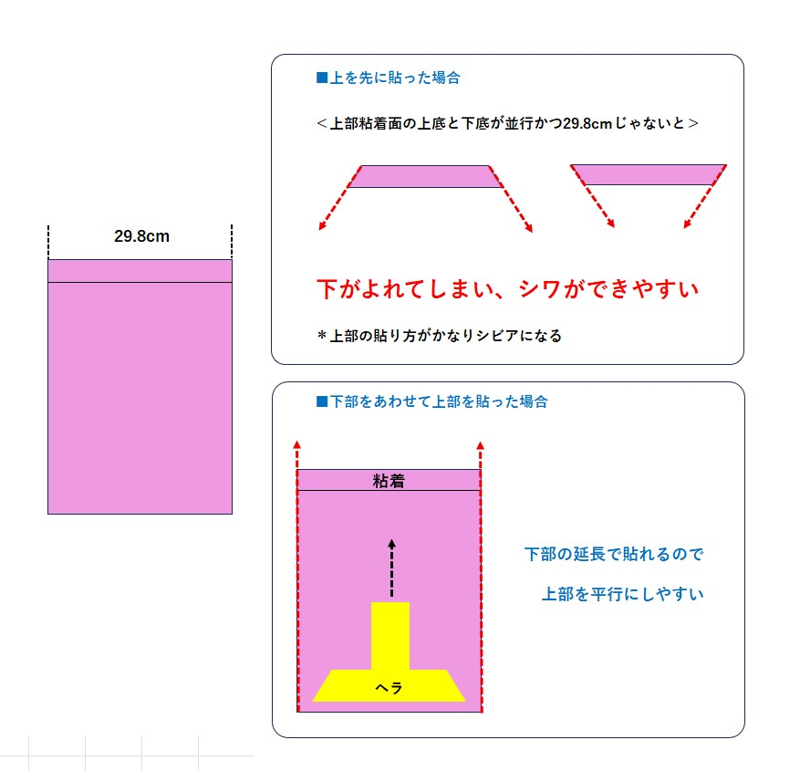

# ポスター張りについて

## 準備
### ポスター受け取りについて

ポスター受取は、
- 6/27（たぶん17時以降）～6/29あたり
  
[新宿れいわボランティアセンター(新宿西口カンファレンスセンター)](https://www.kashikaigishitsu.net/facilitys/cc-shinjuku-nishiguchi/)8Dにて受取ってください。

初めての方は、最初経験者のレクをしますので、そのタイミングでポスター、掲示板地図、をお渡し致します。

### 持ち物
- 雑巾1 押さえつけ用
- (雑巾2 雨の日用)
- 雑巾を首などからぶら下げる紐
- (ポスター)
- (掲示板地図)
- ゴミ袋(結構、裏紙が出ます)
- 飲み物・飴(暑いので熱中症に注意しましょう)

## 貼り方
### 説明
[動画説明(クリックしてね)](img/how_to_poster.mp4)

## 報告
### 掲示板の番号について
LINEにて、掲示板のどこに貼るかを通知します。

それまでは、最初の場所で待機をお願いします。

### LINEにての報告
1. ブロック終わったごとに、LINEグループに「Xブロック終わりました」と報告いただけると、全体の進捗がわかるのでよろしくお願いいたします。

2. 全部貼り終えた時には「担当分終わりました」と報告ください。

3. 時間切れで、貼りきれなかった場合には、他のメンバーで追って貼ります。どこが貼れていないか、明示して報告をお願いいたします。

